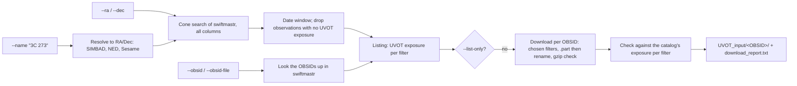

# Step 2 — Download data

`swift_uvot_download.py` finds the Swift observations of your source, lists
them with their UVOT exposure in each filter, and downloads the UVOT files
the later steps need into one folder per observation (OBSID). You point it at
a source — by name, by coordinates, or by an explicit list of OBSIDs —
optionally narrow to a date window, and choose the filters.

Run it in the HEASoft terminal (`setup_swiftuvot; heainit`); it needs only
Python with `requests` and `astropy`, so any terminal with those works.

## What runs

Two modes:

- **Listing** (`--list-only`): resolves the name or position, searches the
  Swift master catalog (`swiftmastr`) within 12′, applies the date window and
  prints one row per observation with its UVOT exposure per filter. Nothing
  is downloaded. With `--obsid`/`--obsid-file` it looks those OBSIDs up in
  the catalog and lists them the same way.
- **Download**: the same query, then the files, then a check of what arrived
  against the catalog, and a report.

| Flag | Purpose |
| ---- | ------- |
| `--name` / `-n` | Source name to resolve (e.g. `"3C 273"`), then a cone search |
| `--ra` / `--dec` | Search at an explicit J2000 position (decimal degrees) |
| `--obsid` | One observation by ID (no cone search) |
| `--obsid-file` | OBSIDs from a file, one per line (`#` comments allowed) |
| `--start-date` | Keep observations on or after this date (UTC, **inclusive**) |
| `--end-date` | Keep observations strictly before this date (UTC, **exclusive**) |
| `--radius` / `-r` | Cone-search radius in arcminutes (default 12) |
| `--filters` | Filter codes to download (default `vv bb uu w1 m2 w2`, the six photometric filters; also `wh`, `gu`, `gv`, `mg`) |
| `--products` | Archive folders (default `uvot/image uvot/event uvot/hk auxil`) |
| `--skip-raw` | Don't download raw images (`*_rw.img.gz`) |
| `--outdir` / `-o` | Output folder (default `UVOT_input`) |
| `--nproc` | Observations to download at once (default 1; 4 is a polite maximum) |
| `--list-only` / `-l` | List without downloading |
| `--max-obs` / `-m` | Download at most this many observations |
| `--overwrite` | Re-download files that are already there and intact |
| `--verify` | Check files already on disk against the server and decompress them (slower) |

`--name`, `--ra`/`--dec`, `--obsid` and `--obsid-file` are mutually exclusive.

## How it works



**The listing.** One row per observation, from the catalog:

```
$ swift_uvot_download.py --name "3C 273" --list-only --start-date 2009-01-01 --end-date 2009-03-01
...
  OBSID       Date       Off(')  Target               UVOT(ks)      V     B     U  UVW1  UVM2  UVW2  other
  --------------------------------------------------------------------------------------------------------
  00035017018 2009-01-12    0.6  3C273                   2.54   0.21  0.21  0.21  0.43  0.62  0.85
  00035017019 2009-01-31    0.2  3C273                   0.44      -     -     -     -  0.22  0.22
  00035017020 2009-01-31    1.4  3C273                   0.45   0.01  0.22  0.22     -     -     -
  ...
```

`Off(')` is how far Swift pointed from your source (shown for `--name` and
`--ra`/`--dec`). `other` lists exposures in WHITE, the grisms and the
magnifier, which are not downloaded unless you ask for them.

**Where the files come from.** The HEASARC archive keeps each observation
under the year and month it started (`obs/2013_04/00035017124/`); the catalog
gives the start as an MJD, which the script converts. If that folder is
missing it tries the next month, then the UKSSDC mirror
(`swift.ac.uk/archive/reproc`), whose UVOT files are byte-for-byte the same.

**Which files.** In `uvot/image` and `uvot/event` only the chosen filters are
downloaded (the filter code is in each file name, e.g.
`sw00035017124uw2_sk.img.gz`); `uvot/hk` and `auxil` are downloaded whole.
Observations with no exposure in the chosen filters (for 3C 273: some that
used only the grisms or the BLOCKED position) are skipped and reported as
`no_data`.

**Safe downloads.** Each file goes to `<name>.part` and is renamed only when
it is complete and, for `.gz` files, decompresses to the end. Network errors
are retried three times and then counted as failed files; the run continues.
Because only checked files are renamed into place, a file already on disk is
kept without asking the server, so re-running the same command resumes an
interrupted download quickly, and Ctrl-C never leaves a partial file behind.
`--verify` checks files that are already there (same size as on the server,
decompresses cleanly) and replaces the bad ones: use it for files put there
some other way, or to look for damage.

If the archive refuses requests (HTTP 403, 429) or has server errors, the
script waits 5, 15, then 45 s and retries; if HEASARC still refuses a folder,
it takes that folder from the UKSSDC mirror and says so in the report.

**The check.** For each observation, every filter the catalog lists with
exposure must have a sky image (`*_sk.img.gz`), and every sky image an
exposure map (`*_ex.img.gz`). Anything missing is reported as `check`: the
archive lacks a file the catalog lists. Re-running does not change that.

**The report.** `download_report.txt` in the output folder has one line per
observation (status, files new/kept/failed, the filters the catalog lists,
the archive used) and then every failure, check and note.

The exit status is 1 if any file failed or an OBSID was not found in either
archive (130 if interrupted), so the step can be scripted; re-running retries
only what is missing.

**Timing and size on amorgos.** All of 3C 273 (`--name "3C 273" --nproc 4`):
the cone search finds 381 observations within 12′, 13 have no UVOT exposure
and are left out, 13 more used only the grisms or the BLOCKED position
(`no_data`), and 355 are downloaded — 11,516 files, 4.9 GB, in 8 minutes,
with no failures and nothing missing compared with the catalog. Of the
4.9 GB: sky images 2.7, raw images 0.7, `auxil` 0.7, event files 0.5,
exposure maps 0.2, housekeeping 0.1. A re-run that finds everything in place
takes about a minute (it lists each archive folder); `--verify` takes about
5.

## Inputs and outputs

**Inputs:** a source name, coordinates, or OBSIDs; optionally a date window
and filters.

**Outputs:** one folder per OBSID under `--outdir`, mirroring the archive:

```
UVOT_input/
├── download_report.txt
└── 00035017124/
    ├── uvot/image/
    │   ├── sw00035017124uw2_sk.img.gz    sky image: one extension per exposure    ← Steps 3-5
    │   ├── sw00035017124uw2_ex.img.gz    exposure map, same extensions             ← Steps 3-5
    │   └── sw00035017124uw2_rw.img.gz    raw (detector) image                      ← quality maps, re-imaging
    ├── uvot/event/
    │   └── sw00035017124uw2w1po_uf.evt.gz   event list, for exposures taken in event mode
    ├── uvot/hk/                          UVOT housekeeping
    └── auxil/                            spacecraft attitude (sat, pat, uat), orbit, filter file
```

Filter codes in file names: `vv` V, `bb` B, `uu` U, `w1` UVW1, `m2` UVM2,
`w2` UVW2, `wh` WHITE, `gu`/`gv` UV/V grism, `mg` magnifier.

**Each sky image holds several exposures.** A UVOT `*_sk.img.gz` file has one
FITS extension per exposure in that filter (named e.g. `uu387398273I`, `I`
for image mode, `E` for an image built from event data), and they can differ
in frame time, window and aspect correction. Step 3 lists every extension.

## Common variants

```bash
# List first
swift_uvot_download.py --name "3C 273" --list-only

# A date window, four observations at a time
swift_uvot_download.py --name "3C 273" --start-date 2009-01-01 --end-date 2010-01-01 \
    --outdir UVOT_input --nproc 4

# Explicit OBSIDs
swift_uvot_download.py --obsid-file my_obsids.txt --outdir UVOT_input

# Only the UV filters, without raw images
swift_uvot_download.py --name "3C 273" --filters w1 m2 w2 --skip-raw --outdir UVOT_input

# Resume or repair: run the same command again
```

## Gotchas

1. **The cone search returns every pointing within 12′,** including other
   targets: for 3C 273, pointings of the AGN SDSS J122933+015810. The
   listing's `Target` and `Off(')` columns show them; Step 3 tells you whether
   your source is actually in each image (in small hardware windows it often
   is not).

2. **Dates:** always `YYYY-MM-DD`; `--start-date` is inclusive and
   `--end-date` exclusive. The catalog's `start_time` is an MJD; the script
   converts it.

3. **`check` is the archive's problem, `failed` is yours.** `failed` files
   (network, server) come back when you re-run; a `check` line means the
   archive lacks a file the catalog lists, and re-running won't help. Step 3
   carries both into its ledger.

4. **Keep `--nproc` modest** (≤ 4): HEASARC serves everyone. An earlier
   version that asked the server about every file of 3C 273 at ~100 requests
   per second got HTTP 403 for 105 observations' folders; the script now backs
   off and falls back to the mirror, and a re-run no longer asks about files
   it already has.

## Notes

<!-- Eileen: drop observations here as you walk through. Format suggestion:
     - 2026-MM-DD — observation / gotcha / "I ran this on X and Y happened"
-->

_(no notes yet)_
