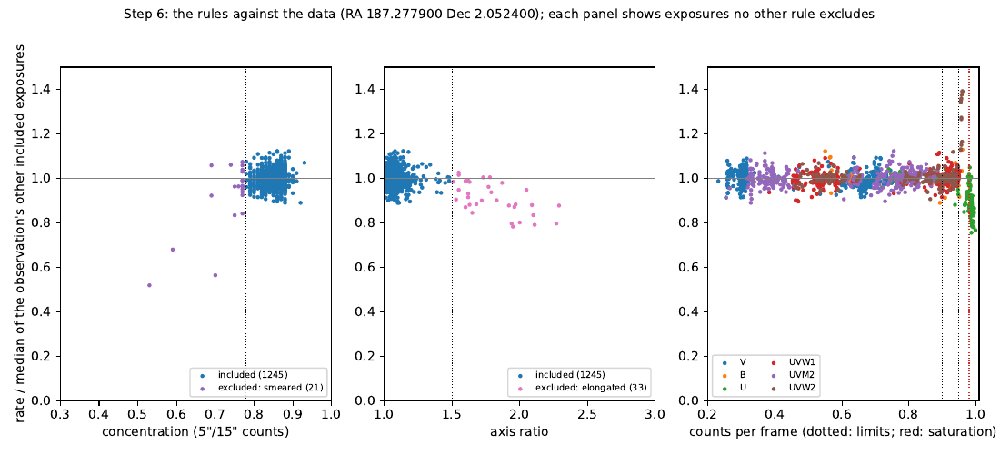
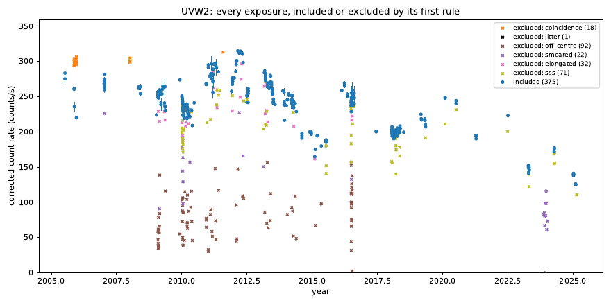

# Step 6 — Quality rules and the master table

`make_uvot_master_table.py` joins Steps 3–5 into one row per exposure: every
extension of every sky image, so each one is accounted for. Then it decides
by rule which exposures the light curve uses. Each row gets `include` = `yes`
or `no`, plus the rules that excluded it. The table is regenerated, never
edited. Your own decisions go in an overrides file, which is applied every
time, so a re-run never loses them.

It reads only the tables of Steps 3–5, so it runs in either terminal and
takes a few seconds.

## What runs

```bash
make_uvot_master_table.py
```

| Flag | Purpose |
| ---- | ------- |
| `--outdir` | Steps 3–5's output folder (default `UVOT_output`) |
| `--sss-level` | Exclude exposures on a low-sensitivity patch at this level or a stricter one: `LOW` (default), `MID` or `HIGH` |
| `--coincidence-limit FILTER=VALUE` | Change a filter's counts-per-frame limit (default U 0.90, others 0.95); can be repeated |

## How it works

**The rules.** An exposure is excluded if any of these applies. The limits
come from the 3C 273 data, as described below.

| Rule | Excludes | Why |
| ---- | -------- | --- |
| `step3:<status>` | exposures that were not candidates in Step 3 (`not_covered`, `partial`, ...) | no usable image of the source |
| `step4:<status>`, `step5:failed` | exposures without regions or photometry | nothing to use |
| `saturated` | more than 0.98 counts per frame | `uvotsource` caps the rate: it is only a lower limit |
| `coincidence` | above the filter's limit: U 0.90, others 0.95 counts per frame | the coincidence-loss correction goes wrong below the cap: full-frame U above 0.93 reads 8 % low, UVW2 above 0.95 reads 13–39 % high |
| `sss` | on a low-sensitivity patch at `--sss-level` (LOW) | rates 5 % low on average, 29 % of them more than 10 % low |
| `off_centre` | source found more than 3″ from the region centre, so Step 4 left the region at `--ra`/`--dec` | the region misses the source: rates 0.30 of the truth |
| `smeared` | concentration (5″/15″ counts, Step 4) below 0.78 | light outside the 5″ region: 3 % low at 0.75–0.78, far more below |
| `elongated` | axis ratio above 1.5 | trailed: 5–12 % low |
| `jitter` | taken during the spacecraft jitter (7 August 2023 – 4 April 2024) with no measurable PSF | the image cannot be checked |
| `duplicate` | same `EXPID` as an included exposure (image- and event-mode copy) | counted once |
| `override:N` | excluded by line N of the overrides file | your decision |

Exposures with low S/N are *not* excluded: for a faint source they are the
non-detections Step 7 turns into upper limits. In the jitter period an
exposure whose PSF can be measured is judged by the shape rules like any
other.

**Flags** mark included exposures without excluding them:

- `sss_mid` and `sss_high`: on a patch only at a level the rule doesn't exclude.
- `jitter_ok`: taken during the jitter, but the PSF check passed.
- `no_aspcorr`: no aspect correction; the region is centred on the source.
- `short`: exposure under 20 s.
- `discrepant`: the rate differs from the error-weighted mean of the rest of
  its observation and filter by more than 10 % and 5σ, both errors combined.
- `override:N`: included by line N despite the listed rules.

**Overrides.** Create `UVOT_output/uvot_overrides.txt`:

```
# obsid        filter  extname        action   note
00031659123    *       *              exclude  streaked second snapshot
00035017124    U       uu387398273I   include  checked by eye
```

`*` matches anything, and a later line wins over an earlier one. An
`include` can't bring back an exposure without photometry (e.g.
`not_covered`); the script warns and ignores it. When an override includes
an exposure the rules exclude, the `rules` column still lists those rules
and `flags` names the override line.

**Changes.** Each run compares `include` with the previous master table and
lists the exposures that changed, so a new rule, limit or override shows its
effect at once.

### How the limits were set

3C 273 does not change noticeably within one observation, so each exposure
can be compared with the clean exposures of the same observation and filter.
Clean means: not trailed or smeared, S/N ≥ 10, on no patch at any level,
not saturated, at most 0.95 counts per frame, and outside the jitter period.
Clean exposures agree with each other to ±2.8 % (16–84 %, leaving each one
out of its own reference).

**Coincidence loss: same-snapshot pairs.** Within a snapshot, each filter
often has a short exposure with 11 ms frames and a longer one with 3.6 ms
frames (a hardware window). The windowed exposure has far fewer counts per
frame, so the pair tests the correction of the full-frame one. Of 473
pairs, with full-frame rate ÷ windowed rate:

| Filter | Pairs | Full-frame / windowed |
| ------ | ----- | --------------------- |
| UVW1 | 102 | 1.00–1.01 up to 0.95 counts per frame |
| UVW2 | 16 | 0.99–1.00 up to 0.95 |
| UVM2 | 116 | 0.96–1.02 up to 0.85 (1.04 at 0.85–0.90, 3 pairs) |
| V | 141 | 0.98–1.03 (never above 0.8) |
| B | 10 | 0.89–1.02 at 0.85–0.97 (too few to judge) |
| U | 88 | 0.92 at 0.93–0.98 (median of 15; 16–84 %: 0.86–0.97); 0.85 saturated (72) |

Every full-frame U exposure of 3C 273 is above 0.9 counts per frame. Its
windowed partner is itself strongly corrected (0.76 counts per frame, a
factor of about 1.9), so which of the two is right can't be settled here.
An absolute check needs another method, such as readout-streak photometry
(a to-do). UVW2 at 0.955–0.96 counts per frame (13 exposures, all from 2005)
reads 13–39 % higher than the rest of its observation (right-hand panel of
the figure below).

**Shape.** The rate against concentration (axis ratio ≤ 1.25, region at the
centroid) and against axis ratio (concentration ≥ 0.78):

| Concentration | Rate / clean median | | Axis ratio | Rate / clean median |
| ------------- | ------------------- | - | ---------- | ------------------- |
| 0.82 and above | 1.00 | | up to 1.5 | 0.99–1.00 |
| 0.78–0.82 | 0.99 | | 1.5–1.7 | 0.95 |
| 0.75–0.78 | 0.97 | | above 1.7 | 0.88 |

The bias at 0.75–0.82 also appears at low counts per frame, so it is a
broader PSF, not coincidence loss.

**Low-sensitivity patches:** LOW 0.95, MID-only 0.99, HIGH-only 1.00 (Step
5). The default excludes LOW only; `--sss-level MID` also excludes the
MID-only exposures (about 1 % low).

**The jitter period** can't be checked this way: no jitter-period
observation of 3C 273 has two exposures in one filter that both pass the
shape checks. So its exposures are judged by their PSF.



*The first page of `uvot_master_table.pdf` for 3C 273. Each panel shows the
exposures no other rule excludes: rate against concentration, axis ratio
and counts per frame, relative to the observation's other included
exposures. Dotted lines mark the limits.*

For all of 3C 273:

```
[summary] 2935 exposures: 1955 included, 980 excluded
          filter  exposures  included  included exposure (s)
          V             487       440                  36365
          B             197       141                  11555
          U             505       138                  14545
          UVW1          528       419                  83164
          UVM2          571       442                 102181
          UVW2          647       375                 154788
[summary] exposures per rule (one exposure can break several):
          sss                        385, rate 0.92 of the included median (116 with one)
          coincidence                228, rate 0.95 of the included median (43 with one)
          smeared                    201, rate 0.43 of the included median (132 with one)
          saturated                  176, rate 0.85 of the included median (101 with one)
          elongated                  159, rate 0.40 of the included median (125 with one)
          off_centre                 104, rate 0.30 of the included median (83 with one)
          step3:not_covered           41
          jitter                       6
          step3:partial                3
[summary] flags on included exposures: jitter_ok 18, no_aspcorr 729, short 399, sss_high 91, sss_mid 183
[check] included exposures that differ from the rest of their observation by more than 10 % and 5 sigma: 0
```

"Rate ... of the included median" compares each excluded exposure with the
included exposures of its observation and filter, where there are any. The
included exposures add up to 66 % of the measured exposure time.

## What to look for

- **U.** Only 138 of 505 U exposures remain, nearly all with 3.6 ms frames.
  From 2017 to 2022 there are only full-frame U exposures, all at 0.95–0.98
  counts per frame, so U has no points then. A looser limit such as
  `--coincidence-limit U=0.97` brings some back, at the cost of a bias of
  about 8 %.
- **UVW2.** Most of its exclusions are the trailed event-mode snapshot
  openers of 2009–2016 (`off_centre`, `elongated`, `smeared`).
- **Only saturated.** For 25 observation/filter pairs (all U) every measured
  exposure is saturated. Step 7 reports those as lower limits.
- **The jitter period.** 18 of 3C 273's 81 exposures from it are included.
  The rest are smeared (31), on a patch (10), off centre (8), elongated (6),
  without a measurable PSF (6), or above the counts-per-frame limit (2).
- **`discrepant` flags:** none for 3C 273. If there are any, look at them in
  the Step 4 viewer (`swift_uvot_viewer.py --obsid ...`) and exclude them
  with an override if the image is bad.

The per-filter pages of the PDF show every exposure's rate against time,
included or excluded by its first rule:



## Inputs and outputs

**Inputs:** `uvot_inventory.txt`, `uvot_positions.txt` and
`uvot_photometry.txt` from Steps 3–5; optionally `uvot_overrides.txt`.

**Outputs** (in `UVOT_output`):

```
UVOT_output/
├── uvot_master_table.txt   one row per exposure (columns below)
└── uvot_master_table.pdf   the rules against the data, then rate against time per filter
```

| Column | What it is |
| ------ | ---------- |
| `obsid`, `filter`, `extname` | Which exposure |
| `date_mid`, `mjd_mid`, `exposure`, `frametime`, `mode`, `aspcorr`, `first` | From Step 3 (`first`: opens its snapshot) |
| `snr`, `offset`, `axis_ratio`, `conc`, `center`, `sss_low`, `sss_mid`, `sss_high` | From Step 4 |
| `counts_frame`, `saturated`, `rate`, `rate_err`, `rate_lim`, `mag`, `mag_err`, `mag_sys`, `flux_aa`, `flux_aa_err` | From Step 5 |
| `include` | `yes` or `no` |
| `rules` | The rules that exclude the exposure, comma-separated (`-` if none) |
| `flags` | Notes that do not exclude it |

## Common variants

```bash
# Also exclude exposures on a MID-level patch
make_uvot_master_table.py --sss-level MID

# A looser U limit (biased, see above)
make_uvot_master_table.py --coincidence-limit U=0.97

# The included exposures of one filter (include is column 29)
awk '$1 == "obsid" || ($2 == "UVW1" && $29 == "yes")' UVOT_output/uvot_master_table.txt | less -S
```

## Gotchas

1. **Don't edit the table.** It is rewritten on every run; put decisions in
   `uvot_overrides.txt`.

2. **Re-run after any earlier step.** The table is only as current as the
   Step 3–5 tables it reads.

3. **The limits were calibrated on one bright source.** For another bright
   target, check the first page of the PDF. It repeats the comparison with
   that target's own data.

4. **Two concentration limits.** Step 4 flags below 0.70 ("clearly trailed
   or smeared"); this step excludes below 0.78, where the bias reaches 3 %.

5. **Faint sources and the jitter period.** Without a measurable PSF, all
   of a faint source's exposures from the jitter period are excluded.

## Notes

<!-- Eileen: drop observations here as you walk through. Format suggestion:
     - 2026-MM-DD — observation / gotcha / "I ran this on X and Y happened"
-->

_(no notes yet)_
