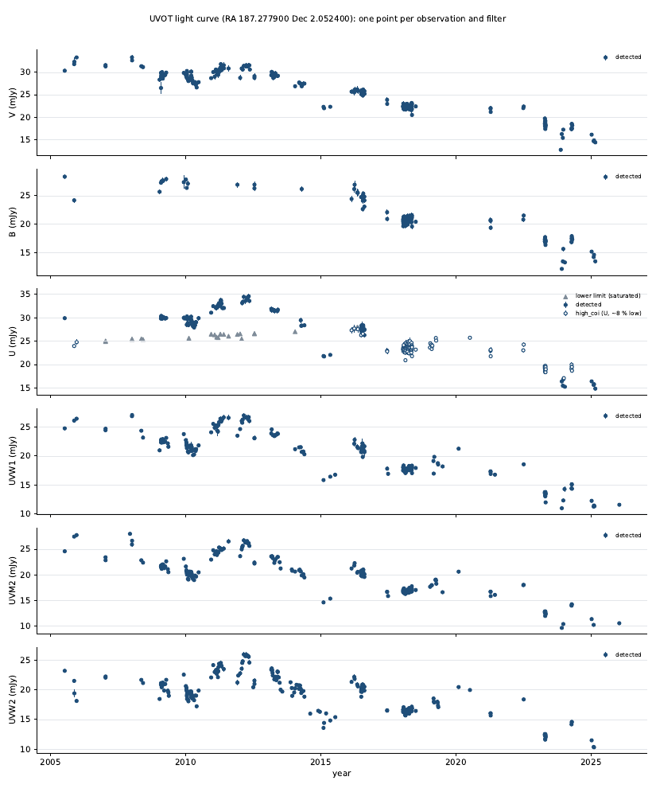

# Step 7 — The light curve

`swift_uvot_lightcurve.py` combines the included exposures of the
[Step 6](06-master-table.md) master table into one point per observation
and filter. It writes the light curve as a table, in count rates, Vega and
AB magnitudes and flux densities, and as a plot. It reads only tables, so it
runs in either terminal and takes a few seconds.

## What runs

```bash
swift_uvot_lightcurve.py
```

| Flag | Purpose |
| ---- | ------- |
| `--outdir` | Steps 3–6's output folder (default `UVOT_output`) |
| `--floor` | Systematic error per exposure, as a fraction of its rate (default 0.015) |
| `--nsigma` | Detection threshold and upper-limit significance (default 3) |

## How it works

**Combining.** The included exposures of one observation and filter are
averaged with inverse-variance weights. Each exposure's error is its
statistical error plus a systematic floor of 1.5 % of its rate, added in
quadrature. The floor comes from the data: included exposures of one 3C 273
observation scatter more than their statistical errors allow, and the
fraction that brings the reduced χ² to 1 is:

| V | B | U | UVW1 | UVM2 | UVW2 |
| - | - | - | ---- | ---- | ---- |
| 1.0 % | 1.6 % | 0.7 % | 1.1 % | 1.3 % | 1.4 % |

The U value leaves out the `high_coi` exposures. Mixed with windowed U they
raise it to 3.8 %, because they read about 8 % low. So within an observation
the `high_coi` U exposures are used only when there is no other U exposure.

The point's time is the exposure-weighted mean of the exposures' midpoints.
`mjd_start` and `mjd_stop` span the exposures used. With two or more
exposures, `chi2_red` shows how well they agree; a point is flagged
`scatter` if the χ² probability is below 0.001.

**Statuses.** Each observation and filter gets one:

| Status | Meaning |
| ------ | ------- |
| `detected` | combined rate / error ≥ 3 |
| `upper_limit` | below that; the magnitude and flux columns hold max(rate, 0) + 3σ |
| `lower_limit` | nothing included, but some exposures were excluded only for saturation; the highest capped rate, a lower limit on the true one |
| `excluded` | exposures were measured, but none was included (the reason lists the rules) |
| `not_covered` | no exposure had the source in its field |

**Units.** Magnitudes and flux densities use `uvotsource`'s own conversion,
read from Step 5's output tables: the Vega and AB zero points and the flux
density per count/s in each filter. They are listed in the table header.
`mag_err` is statistical plus the floor. `mag_sys` is the absolute
calibration (zero-point) error: 0.01 mag in V, 0.02 in B and U, 0.03 in
the UV. It is not included in `mag_err`, because it shifts every point of
a filter together.

**Flags** carried from the exposures: `high_coi` (U, probably about 8 % low),
`jitter_ok` (taken during the 2023–24 jitter, PSF check passed),
`discrepant`, `sss_mid`, `sss_high`; and `scatter`.

For all of 3C 273:

```
[summary] filter  detected  upper_limit  lower_limit  excluded  not_covered  high_coi  scatter
          V            250            0            0        15            0         0        0
          B            125            0            0        25            0         0        0
          U            215            0           23        28            1        97        1
          UVW1         228            0            0        50            0         0        0
          UVM2         229            0            0        50            1         0        1
          UVW2         253            0            0        52            7         0        1
```



*`uvot_lightcurve.pdf` for 3C 273: flux density against time, one panel per
filter. Open circles are U points from `high_coi` exposures; grey triangles
are saturated lower limits.*

## What to look for

- **`high_coi` U points** (97 for 3C 273, all of U from 2017 to 2022): about
  8 % low. Compare them with UVW1 and B before using U colours.
- **Lower limits** (23, all U, 2007–2016): every exposure was saturated.
  They sit below the measured U points, as they should.
- **`jitter_ok` points** (18, Nov 2023 – Jan 2024): their PSF passed the
  shape checks, but look at them. The V point of 00031659120 (2023-11-15,
  12.7 mJy) is about 20 % below its neighbours.
- **`excluded`** (220): for most of them (135) every exposure was on a LOW
  low-sensitivity patch. Excluding at LOW was the Step 6 default; Step 6's
  docs show the bias.
- **`scatter`** (3): the exposures of one observation disagree. The U point
  of 00089029001 contains the `discrepant` exposure from Step 6.
- **Non-detections:** none for 3C 273. A faint target (planned: PKS 0537−286)
  is the test for upper limits.

## Inputs and outputs

**Inputs:** Step 6's `uvot_master_table.txt`; Step 5's `uvot_photometry.txt`
and FITS tables (for the conversion factors).

**Outputs** (in `UVOT_output`):

```
UVOT_output/
├── uvot_lightcurve.txt    one row per observation and filter (columns below)
└── uvot_lightcurve.pdf    flux density against time, one panel per filter
```

| Column | What it is |
| ------ | ---------- |
| `obsid`, `filter` | Which observation and filter |
| `date_mid`, `mjd_mid`, `mjd_start`, `mjd_stop` | Exposure-weighted mean time (UTC) and the span of the exposures used |
| `status` | See above |
| `n_used`, `n_total`, `exposure` | Exposures used, exposures in the observation and filter, exposure time used (s) |
| `rate`, `rate_err`, `snr`, `chi2_red` | Combined corrected rate (counts/s), its error (floor included), S/N, reduced χ² |
| `mag`, `mag_err`, `ab_mag`, `ab_mag_err`, `mag_sys` | Vega and AB magnitudes; for an upper or lower limit the limit itself |
| `flux_aa`, `flux_aa_err`, `flux_mjy`, `flux_mjy_err` | Flux density (erg s⁻¹ cm⁻² Å⁻¹; mJy) |
| `flags`, `reason` | Flags carried from the exposures; why a point is a limit or excluded |

## Common variants

```bash
# A larger systematic floor
swift_uvot_lightcurve.py --floor 0.02

# The detected UVW1 points
awk '$2 == "UVW1" && $7 == "detected"' UVOT_output/uvot_lightcurve.txt | less -S
```

## Gotchas

1. **Re-run after Step 6** (a new rule, limit or override).

2. **Fluxes are not dereddened.** Galactic extinction correction is a
   separate, planned script.

3. **The conversion assumes `uvotsource`'s spectrum.** Its flux factors are
   for an average spectrum; for strong emission lines or very red sources
   the flux density in a broad UV filter can be off. Count rates are the
   safe quantity.

4. **`mag_sys` is not in `mag_err`.** Add it when comparing with other
   instruments, not when comparing UVOT points of one filter.

## Notes

<!-- Eileen: drop observations here as you walk through. Format suggestion:
     - 2026-MM-DD — observation / gotcha / "I ran this on X and Y happened"
-->

_(no notes yet)_
